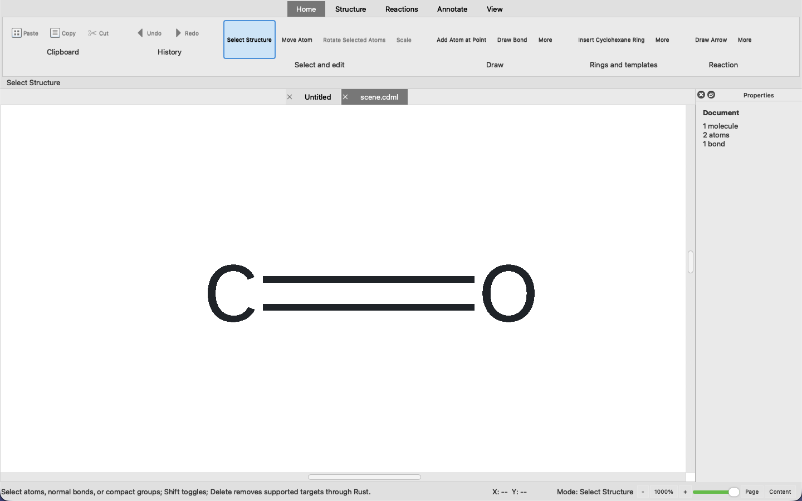
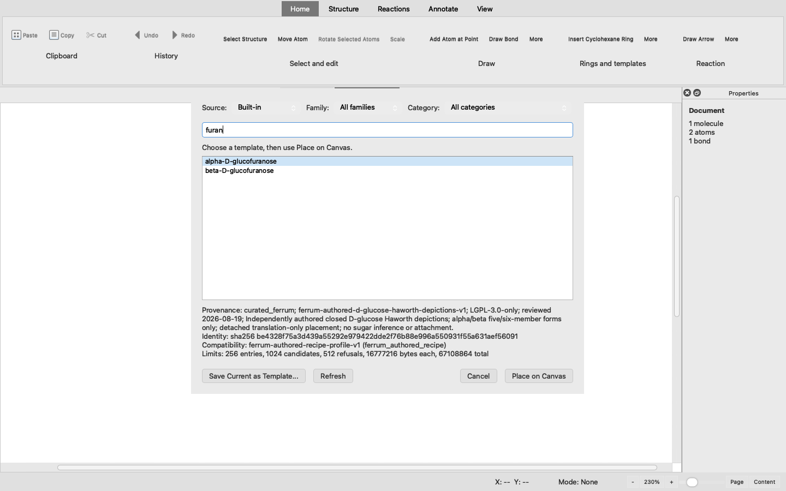
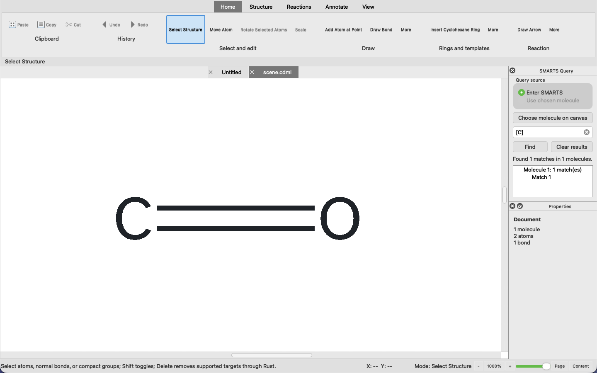
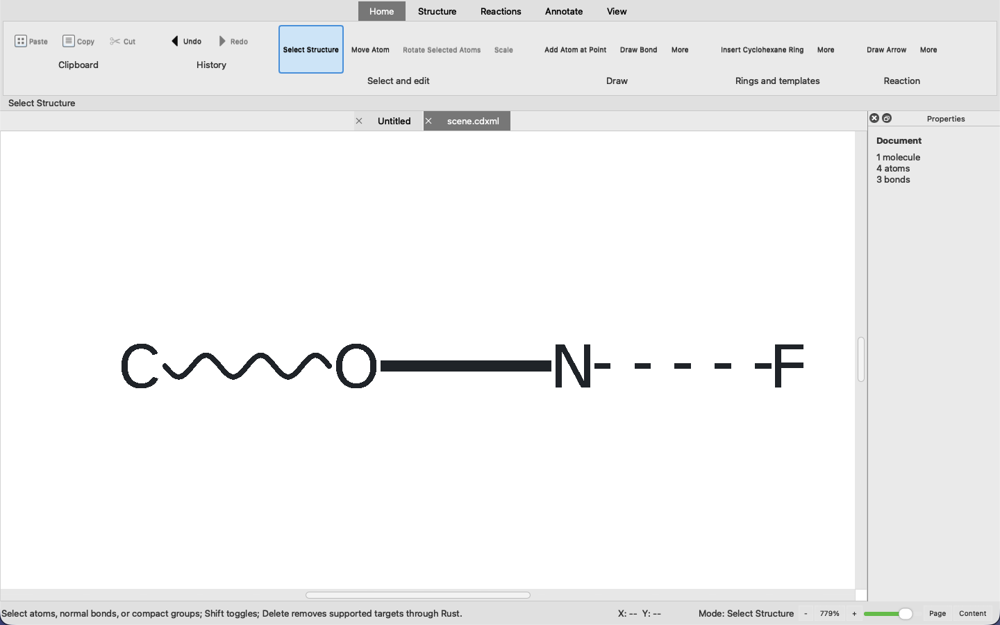
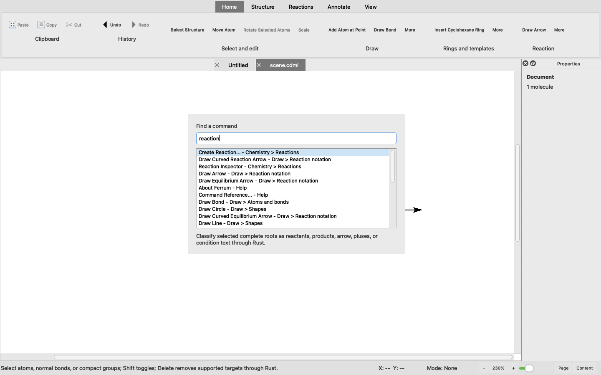

# Ferrum Chemical Forge

A pre-alpha chemical-document workspace for chemists and developers that unifies a
Rust-owned document model with a PySide6 drawing editor and local CLI.

> Status: Ferrum currently runs only from a macOS arm64 checkout. Its bounded Rust,
> PyO3, and Qt workflows have local automated evidence, but it is not release-ready,
> does not claim complete historical-feature parity, and still needs native-window
> visual and accessibility acceptance before broader adoption.

## One document, two routes

Ferrum makes the chemical document, rather than either interface, the source of truth.
Rust owns CDML records, validation, document history, chemistry boundaries, and render
plans. The `ferrum` CLI and `ferrum-qt` desktop editor consume those same issued facts,
so a drawing can move between scripted inspection and interactive authoring without a
second chemistry implementation.

That is Ferrum's signature promise: the editor and command line are two ways to work
with one Rust-governed chemical document. The currently implemented slice lets you:

- Inspect, validate, rewrite, render, convert, and run versioned document operations
  through the local CLI.
- Author supported CDML drawings in the PySide6 editor, with save, Undo/Redo, and
  Rust-produced SVG, PDF, and transparent PNG artifacts.
- Preserve admitted CDML structure and persistent identity during structural rewrite;
  rewrites deliberately do not promise byte-for-byte preservation.
- Receive typed refusals for unsupported files and document features instead of silent
  changes to the active document.

## Current renderer evidence

Ferrum's molecule labels use the Rust-selected, byte-verified Atkinson Hyperlegible
Next Regular resource. All 14 fixed native and installed-Qt glyph-bond cases, plus a
one-time 80-scene style/rotation matrix, pass the automated pixel policy; this is
evidence for that bounded renderer contract, not a substitute for the remaining
native-window human review. See
[docs/GLYPH_BOND_MEASUREMENT.md](docs/GLYPH_BOND_MEASUREMENT.md) for the measurement
boundary and [docs/ROADMAP.md](docs/ROADMAP.md) for the remaining release work.

## The desktop workspace

Ferrum is a chemical drawing workspace, not a separate file-format viewer. The editor
opens the supported CDML slice and presents Rust-issued document and rendering facts.
The inspected current desktop tour appears in the managed block below; its complete
capture workflow and all 13 scenes are in [docs/GUI_TOUR.md](docs/GUI_TOUR.md).

<!-- screenshots:begin (managed by screenshot-docs) -->





<!-- screenshots:end -->

## Quick start

The current local route requires macOS arm64, Rust 1.97.1 or newer, Python 3.12, and
the dependencies described in [docs/INSTALL.md](docs/INSTALL.md). From a checkout,
build the CLI, private native runtime, and Qt launcher:

```bash
./build.sh
build/bin/ferrum --version
build/bin/ferrum formats
```

The build stays below `build/`: it neither installs Ferrum globally nor discovers a
per-user engine. `ferrum formats` is the first useful result; it prints the declared
input/output catalog and whether each route requires the local chemistry runtime.

To launch the desktop workspace after the same build, use an active macOS desktop
session:

```bash
build/bin/ferrum-qt
```

## A small CLI transformation

Ferrum's conversion route accepts only its declared format catalog. This verified
example turns a SMILES record into a V2000 molfile on standard output:

```bash
printf 'CCO\n' | build/bin/ferrum convert - --from smiles --to molblock_v2000
```

The result is a three-atom, two-bond V2000 record. Add `--output ethanol.mol` to
publish it as a new file. Use [docs/USAGE.md](docs/USAGE.md) before applying
interchange routes in a workflow: CML/CML2, CDXML, CD-SVG, and document artifacts have
deliberately bounded admission and publication rules.

## What is supported today

CDML is Ferrum's sole editable document, session, history, and Qt-local format. Desktop
**File > Open** supports native CDML, decoded CD-SVG, bounded CML/CML2 and CDXML
simple-molecule inputs, plus trusted-runtime SDF (`.sdf` and `.sd`) records. Interchange
opens create a clean CDML document, and the first Save or Save As publishes CDML.

Ferrum can render a complete supported document as SVG, PDF, or transparent PNG. It is
not a general-purpose chemistry converter, general SVG editor, or finished replacement
for its historical predecessors. Consult [docs/FILE_FORMATS.md](docs/FILE_FORMATS.md)
before relying on a file route; it owns accepted profiles, resource limits, conversion
losses, and refusals.

## Documentation routes

Start with the route that matches your task:

- [docs/INSTALL.md](docs/INSTALL.md) - macOS dependencies, local build, staged runtime,
  and verification.
- [docs/USAGE.md](docs/USAGE.md) - CLI discovery, document workflows, and protocol examples.
- [docs/FILE_FORMATS.md](docs/FILE_FORMATS.md) - admitted files, conversion boundaries,
  and artifact publication rules.
- [docs/GUI_TOUR.md](docs/GUI_TOUR.md) - desktop workflow and reproducible screenshot
  capture.
- [docs/FERRUM_API_CONTRACT.md](docs/FERRUM_API_CONTRACT.md) - versioned operation
  envelopes, results, and typed failures.
- [docs/CODE_ARCHITECTURE.md](docs/CODE_ARCHITECTURE.md) - Rust, PyO3, and Qt ownership
  boundaries and render data flow.
- [docs/SECURITY_DECISIONS.md](docs/SECURITY_DECISIONS.md) - restrictive parser and
  security-boundary decisions.
- [docs/ROADMAP.md](docs/ROADMAP.md) - pre-alpha milestones, evidence, and remaining
  parity and release work.

## Provenance and licenses

Ferrum's PySide6 application is AGPL-3.0-only under
[LICENSE.AGPL-3.0](LICENSE.AGPL-3.0); the Ferrum-Chem Rust workspace is LGPL-3.0-only
under [LICENSE.LGPL-3.0](LICENSE.LGPL-3.0). [docs/PROVENANCE.md](docs/PROVENANCE.md)
records the code boundary, lineage, notices, and limits of the current pre-production
claim.
