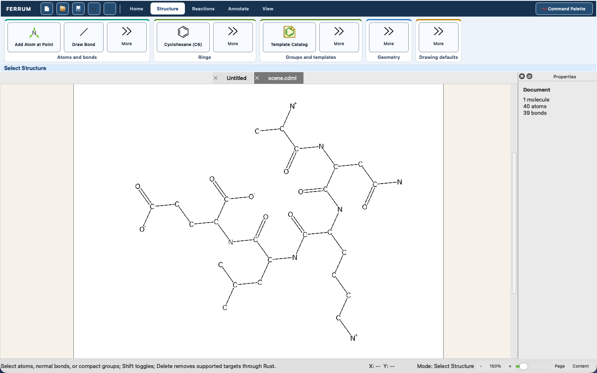
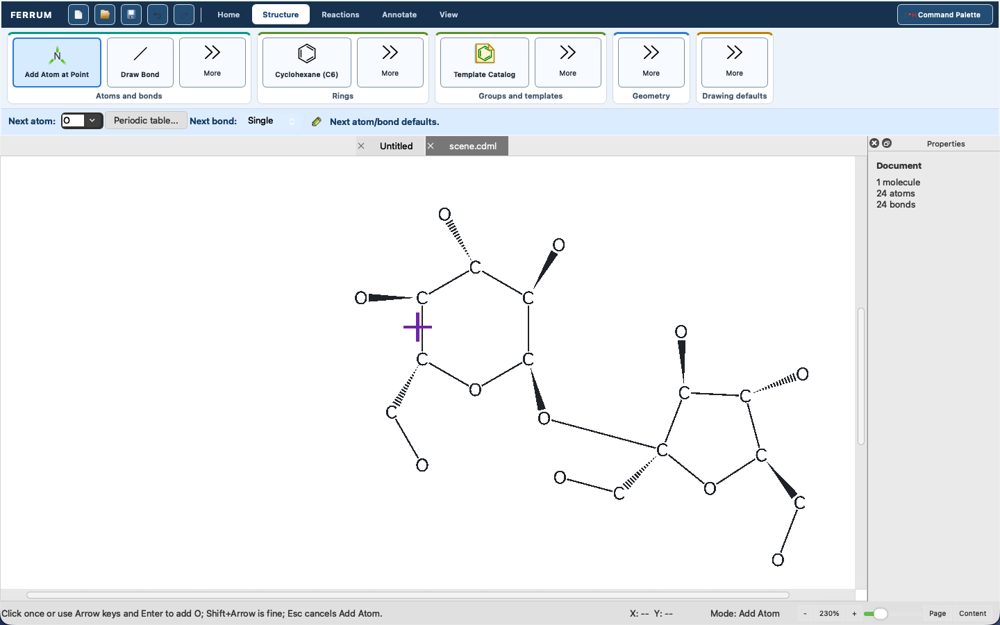
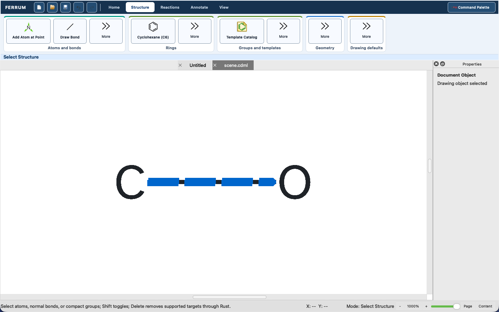
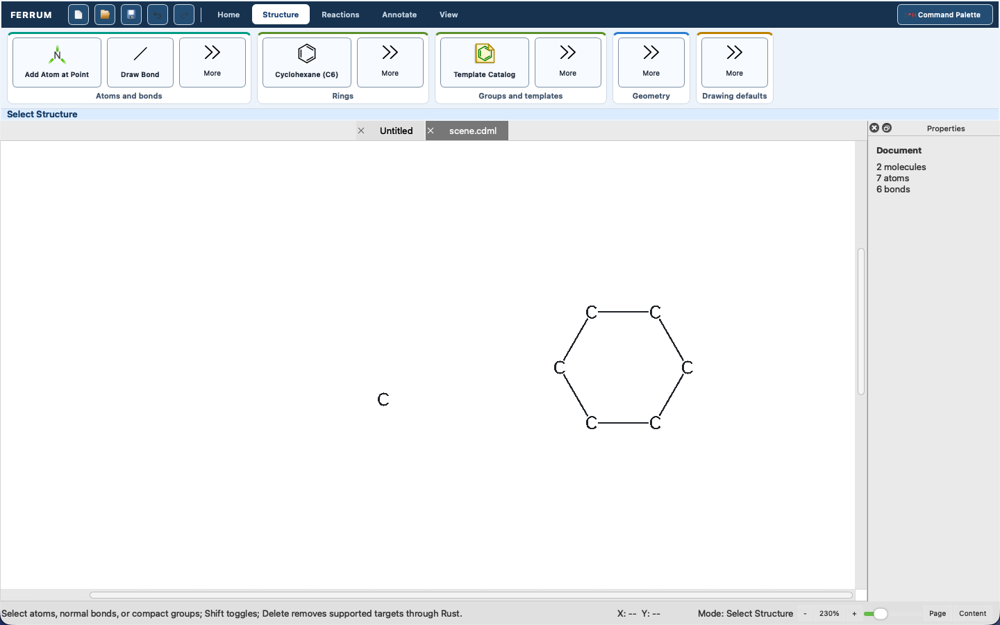
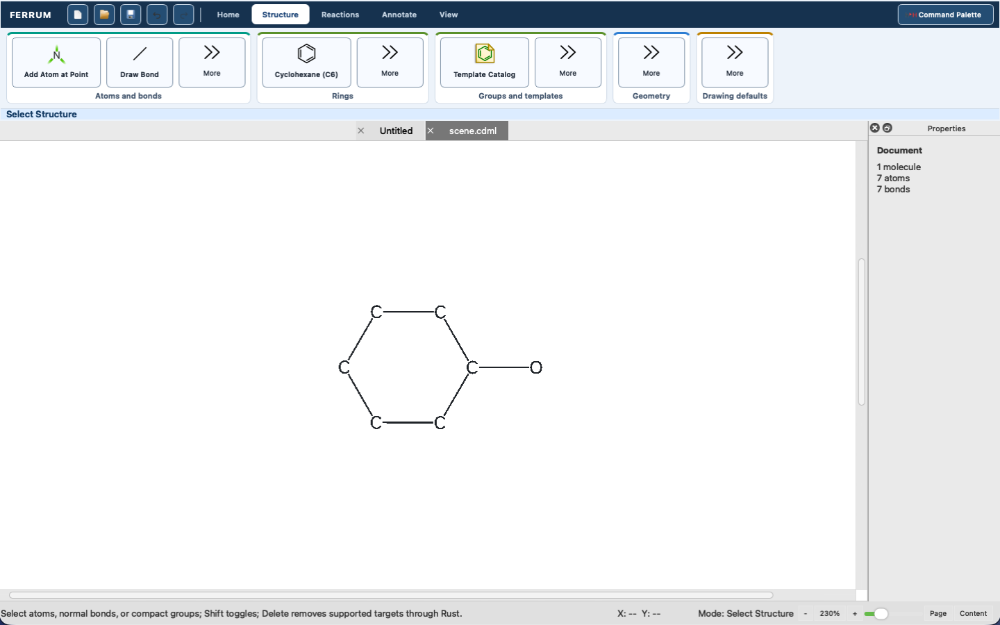
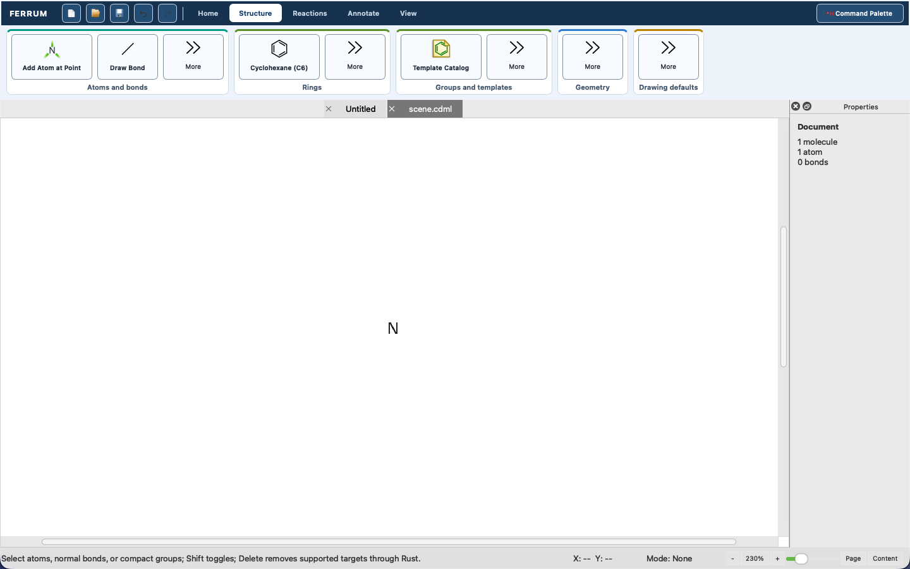
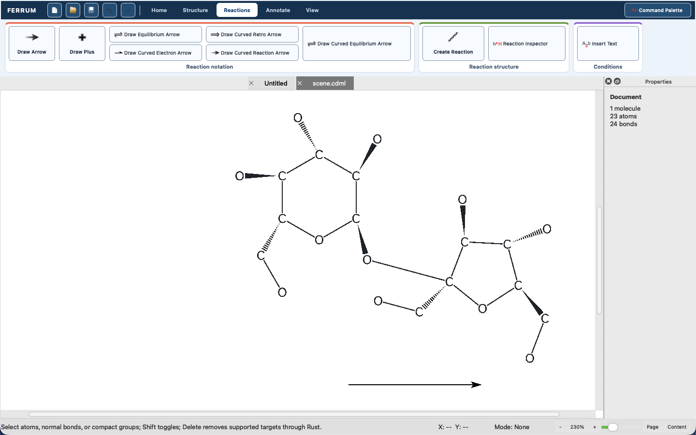
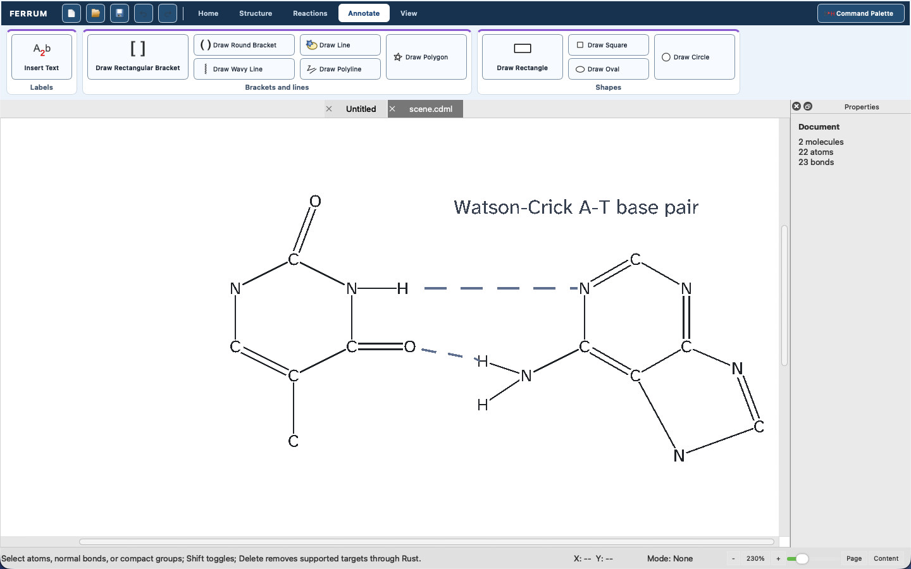
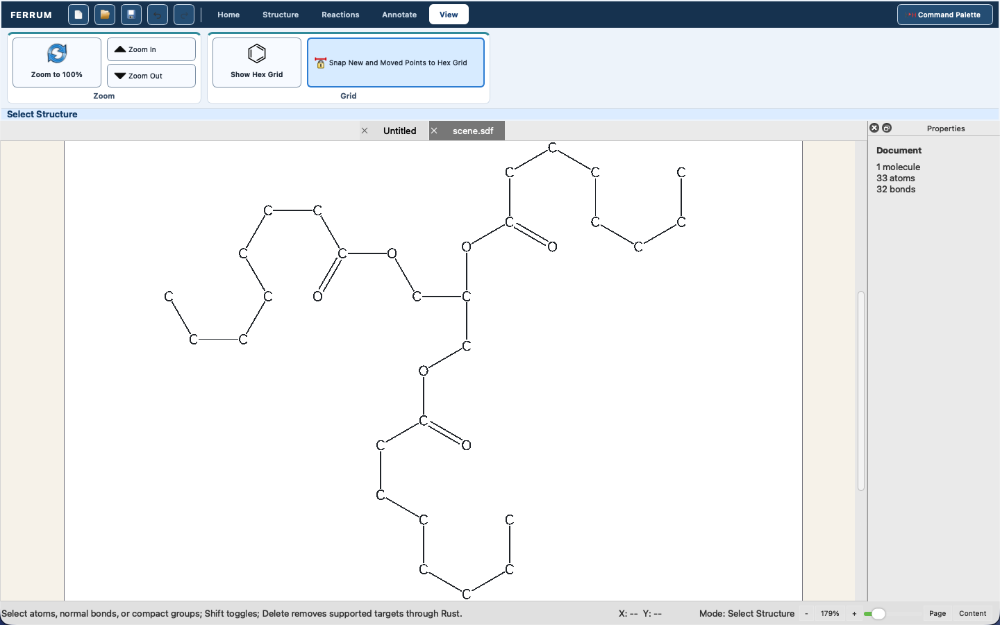

# Ferrum GUI Tour

The Ferrum GUI tour is a manual documentation-capture workflow. It records candidate
user-visible states from the locally built PySide6 application without adding visual
timing, image bytes, or display access to `all_test.sh`.

## Capture command

Build the local application first, then run this command from the repository root with
an active desktop session:

```bash
./build.sh
./capture_gui_screenshots.sh
```

The command uses `source_me.sh` and the promoted `build/current` program through the
stable `build/runtime/python` and `build/bin` links, then starts the PySide6 application.
It applies the light document theme transiently
for deterministic documentation contrast without changing the user's saved theme.
Each scene receives a fresh temporary workspace. The tour uses bounded authored CDML,
the real SDF and CDXML File/Open routes, and Ferrum's native peptide importer. It then
uses Ferrum's visible command and canvas workflows, checks an observable
completed result, retires transient pointer previews, preserves meaningful selection
highlights, exposes the task-appropriate Home, Structure, Reactions, Annotate, or View ribbon
tab, frames the durable content on a high-contrast documentation canvas, hides the optional hex
grid through its visible action, and captures one fixed 1440 by 900 application window. The target is the full
`QMainWindow` surface, including the visible ribbon and status bar; the canvas is framed within that
surface and is not the aspect-ratio boundary. The harness requires a 1440 by 900 logical window and
rejects a staged PNG whose raster aspect is not 16:10. This permits platform display scaling; human
visual review confirms that the captured surface is complete and uncropped.
It stages every requested PNG first. A default full run begins publication only
after every scene and dimension check succeeds, so a failed scene publishes none
of that run. Publication then replaces the stable files sequentially; human review
of the final set remains required. A diagnostic `--scene` run publishes only its
selected image.

Use the following optional commands during local diagnosis:

```bash
./capture_gui_screenshots.sh --list
./capture_gui_screenshots.sh --backend qt
./capture_gui_screenshots.sh --backend easy-screenshot
./capture_gui_screenshots.sh --scene template_catalog
./capture_gui_screenshots.sh --scene workspace --ribbon-tab reactions
```

`--backend auto` is the default. It prefers the `easy-screenshot` `screenshot`
command when installed and able to capture the exact titled Ferrum window. Qt first
uses `QScreen.grabWindow` for the same real visible top-level Ferrum window, then
uses Qt's top-level-widget snapshot when the platform declines that screen grab.
The explicit `easy-screenshot` backend requires the capture process to have the
platform permissions needed for whole-window screen capture.
Each scene owns its task-appropriate ribbon tab. `--ribbon-tab` is a focused diagnostic
override; it does not change the registered full-tour storyboard.

## Storyboard

The registered full-run storyboard targets these paths. A focused diagnostic run
may write one path, but it does not publish or validate the complete tour.

| File | Completed visible capability |
| --- | --- |
| `docs/screenshots/workspace.png` | Editable sucrose with two rings, a glycosidic oxygen, and stereochemical wedge/hash bonds. |
| `docs/screenshots/pentapeptide_import.png` | Native ANKLE pentapeptide import: one 40-atom, 39-bond molecule moved wholly onto the visible page through Ferrum's typed root operation. |
| `docs/screenshots/atom_authoring.png` | Sucrose with one additional authored atom; Add Atom at Point is visibly rearmed. |
| `docs/screenshots/direct_bond.png` | A committed C-O single bond remains selected. |
| `docs/screenshots/inserted_cyclohexane.png` | Detached six-carbon cyclohexane beside the original carbon. |
| `docs/screenshots/attached_cyclohexane.png` | Cyclohexane with all six ring bonds plus the retained host C-O bond; the visible 7-atom/7-bond document proves attachment did not suppress host ink. |
| `docs/screenshots/template_catalog.png` | Alpha-D-glucofuranose selected in the Template Catalog before placement. |
| `docs/screenshots/selected_atom_edit.png` | Carbon changed to nitrogen through the selected-atom editing workflow. |
| `docs/screenshots/smarts_result.png` | Tricaprylin opened through SDF with `[O]` returning all six oxygen matches. |
| `docs/screenshots/reaction_arrow.png` | Straight reaction arrow committed below editable sucrose. |
| `docs/screenshots/presentation_vector.png` | Adenine-thymine pair with two dashed, noncovalent Watson-Crick hydrogen-bond guides. |
| `docs/screenshots/cdxml_open.png` | ChemDraw XML opened as an editable centered C-O-N-F chain with Wavy, Bold, and Dashed bonds. |
| `docs/screenshots/view_controls.png` | Visible status-bar zoom, Page, and Content controls beside complete tricaprylin. |
| `docs/screenshots/command_palette_reaction.png` | Command Palette query showing registered reaction commands above sucrose and a reaction arrow. |

## Current capture status

The complete 14-scene set was regenerated transactionally at 1440 by 900 on
2026-09-01 with `./capture_gui_screenshots.sh --backend qt`. Nine frames use a
biological context: sucrose, the ANKLE pentapeptide, tricaprylin, an adenine-thymine
pair, or the glucose template catalog. Each frame exposes the ribbon tab that owns its
visible task; Home remains visible for general workspace and query context. Every staged scene passed its semantic
postcondition and full-window surface check; the harness also requires the fixed logical
window, a 16:10 raster, and a Properties title bar wide enough for its complete visible
title. The resulting PNGs include the ribbon, document tabs, canvas, relevant docks,
and status bar.

A native-resolution contact-sheet and individual-frame review found the task tabs and
aligned ribbon-card edges consistent across all 14 images. It also found the sucrose stereobonds, complete pentapeptide,
three tricaprylin ester regions, six-match SMARTS result, two base-pair hydrogen-bond
lanes, both nucleobase rings, and the complete reaction-arrow head visible without clipping.
The review found no legacy toolbar screenshot, stale product branding, or image-to-caption
mismatch in the live documentation corpus. This agent review remains separate
from final human native visual,
accessibility, contrast, and focus acceptance.

The biochemical scenes deliberately prove different boundaries. Sucrose is a fixed,
editable stereochemical CDML drawing, not a claim that Ferrum semantically recognizes
sucrose. ANKLE runs through the actual native peptide worker and yields one 40-atom,
39-bond molecule. Tricaprylin runs through bounded SDF ingress, then the live SMARTS
dock reports six `[O]` matches. The adenine and thymine rings are separate molecule
roots; their two dashed presentation lanes remain outside the covalent molecule graph,
so the Properties dock correctly reports only the 23 covalent bonds. Molecular identity
was checked against [PubChem sucrose](https://pubchem.ncbi.nlm.nih.gov/compound/Sucrose),
[PubChem tricaprylin](https://pubchem.ncbi.nlm.nih.gov/compound/Tricaprylin), and the
[PubChem adenine-thymine pair](https://pubchem.ncbi.nlm.nih.gov/compound/Adenine-thymine).

The remaining scenes preserve focused evidence for direct bonds, detached and attached
rings, selected-atom editing, bounded CDXML, reaction arrows, visible view controls, and
the live command registry. The Template Catalog still shows the selected Rust-backed
glucose entry before placement. Command Palette entries come from the ribbon's YAML
command definitions; that ownership is documented here rather than inferred from alt
text.

The CDXML scene makes the repaired atom-label contract visible: each structural element
core is centered on its connected bond axis, while visible glyph ink retains clearance
from the Wavy, Bold, and Dashed painted bond footprints. This is visual documentation
evidence for the Rust render plan, not a pixel-regression test.

The reviewed frames make the current task state and available actions legible: named
ribbon commands identify authoring modes, docks name query/catalog context, and the
status bar reports the active mode and view scale. Final human native visual,
accessibility, contrast, and focus acceptance remains distinct from this documentation
review. The aggregate E2E, PyO3, Qt, and post-fix audit receipts are recorded
separately because a screenshot run does not prove those gates.

These are documentation evidence, not permanent visual-regression tests. The harness
uses visible command actions and canvas events together with controlled application-level
readiness and framing hooks. It does not represent a user-input-only E2E test. It captures
completed artifacts rather than transient pointer previews. Selection highlights may remain when
they explain a completed editing state. The template-catalog
view uses Ferrum's actual selected catalog palette before any placement, making the named catalog
provenance observable without claiming an obscured canvas result. It does not create source files,
application caches, or test artifacts in the repository.

## Regenerated tour

These embeds are the complete current 2026-09-01 documentation tour. Focused diagnostic
captures remain outside this section.
























## Publishing screenshots in documentation

The root [README.md](../README.md) has a managed `screenshot-docs` block populated
from this inspected current tour.
Re-run this command and inspect the resulting images before changing its embeds. Reuse the exact
paths above with descriptive Markdown alt text and never add placeholder images.
